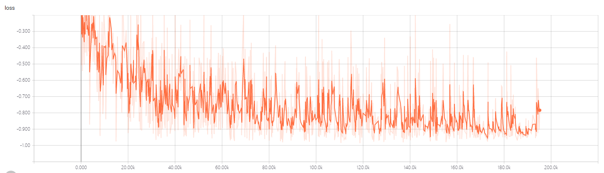
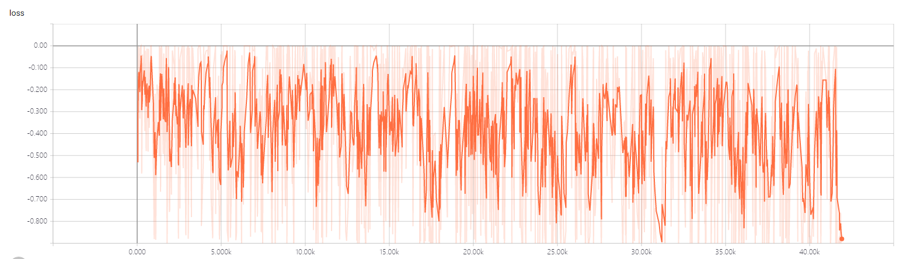
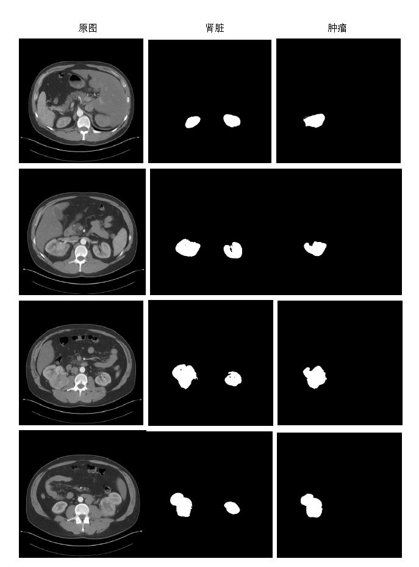
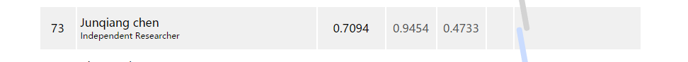

# KiTS19——2019 Kidney Tumor Segmentation Challenge
> This is an example of the CT images Kidney Tumor Segmentation

## Prerequisities
The following dependencies are needed:
- python == 3.5.5
- numpy >= 1.11.1
- SimpleITK >= 1.0.1
- opencv-python >= 3.3.0
- tensorflow-gpu == 1.8.0
- pandas >=0.20.1
- scikit-learn >= 0.17.1
- json >=2.0.9

## How to Use

**1、Preprocess**

* analyze the ct image,and get the slice thickness and window width and position:run the dataAnaly.py

**1.1 Preprocess Kidney**

* keep kidney region into fixed size(512,512,64) for Corse Kidney Segmentation:run the corsedata2dprepare.py
* generate patch(128,128,64) kidney image and mask for Corse Kidney Segmentation:run the corsedata3dprepare.py
* keep Kidney region range image for fine Kidney Segmentation:run the finedata2dprepare.py
* generate patch(128,128,64) kidney image and mask for fine Kidney Segmentation:run the finedata3dprepare.py
* save patch image and mask into csv file: run the utils.py,like file trainSegmentation.csv
* split trainSegmentation.csv into training set and test set:run subset.py

**1.2 Preprocess Kidney Tumor**

* generate tumor image and mask for 2d Kidney Tumor Segmentation:run the tumordata2dprepare.py
* generate tumor image and mask for 3d Kidney Tumor Segmentation:run the finedata3dprepare.py
* save tumor image and mask path into csv file: run the utils.py,like file traintumorSegmentation.csv
* split traintumorSegmentation.csv into training set and test set

**2、Kidney Segmentation**
* the VNet model

 

**2.1 Corse Kidney Segmentation**
* Corse Kidney Segmentation training:run the train_vnet3d_kidney_corse.py
* Corse Kidney Segmentation inference:run the inference_vnet3d_kidney_corse.py
* this step get Corse Kidney range,can find the start and end pos in the kidneyrang.txt

**2.2 Fine Kidney Segmentation**
* Fine Kidney Segmentation training:run the train_vnet3d_kidney_fine.py
* Fine Kidney Segmentation inference:run the inference_vnet3d_kidney_fine.py
* this step following the 2.1 result,get fine Kidney result

**2.3 Fine Kidney Segmentation**
* remove Kidney Segmentation small object:run the segresultprocess.py removekidneysmallobj function

**3、Kidney Tumor Segmentation**
* the VNet2d model

 

**3.1 2d Kidney Tumor Segmentation**
* 2d Kidney Tumor Segmentation training:run the train_vnet2d_tumor.py
* 2d Kidney Tumor Segmentation inference:run the inference_vnet2d_tumor.py
* this step get 2d slice tumor result

* the VNet3d model

 

**3.2 3d Kidney Tumor Segmentation**
* 3d Kidney Tumor Segmentation training:run the train_vnet3d_tumor.py
* 3d Kidney Tumor Segmentation inference:run the inference_vnet3d_tumor.py
* this step get 3d tumor result

**3.3 Kidney Tumor Result Process**
* remove Kidney Tumor Segmentation small object:run the segresultprocess.py remove2d3dtumorsmallobj function
* calculate overlap between 2d tumor and 3d tumor reslut.
* save the region of 2d tumor and 3d tumor reslut that connect overlap region.
* save the region of 2d tumor and 3d tumor within Kidney result.
* merge the above two result and get final tumor result
* all above step can find in the segresultprocess.py

## Result
**1、Kidney Segmentation**
* the train loss

* 200-209case dice value and result

**2、Kidney Tumor Segmentation**
* the 2dtrain loss

* the 3dtrain loss

**3、Lead Board**

## Contact
* https://github.com/junqiangchen
* email: 1207173174@qq.com，1259389904@qq.com
* Contact: junqiangChen，junMa(马骏)
* WeChat Number: 1207173174
* WeChat Public number: 最新医学影像技术
