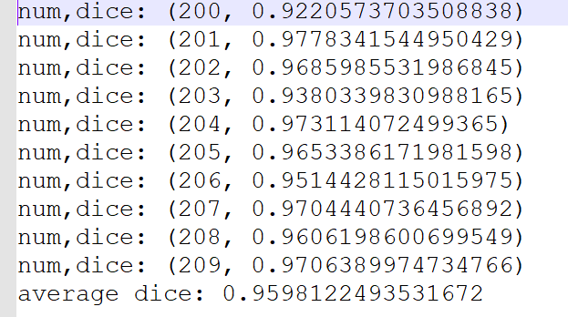

# KiTS19——2019 Kidney Tumor Segmentation Challenge
> This is an example of the CT images Kidney Tumor Segmentation

## Prerequisities
The following dependencies are needed:
- numpy >= 1.11.1
- SimpleITK >=1.0.1
- opencv-python >=3.3.0
- tensorflow-gpu ==1.8.0
- pandas >=0.20.1
- scikit-learn >= 0.17.1
- json >=2.0.9

## How to Use

**1、Preprocess**

* analyze the ct image,and get the slice thickness and window width and position:run the dataAnaly.py
* keep Kidney region range image:run the data2dprepare.py
* generate patch(128,128,32) kidney image and mask:run the data3dprepare.py
* save patch image and mask into csv file:run the utils.py,like file trainSegmentation.csv
* split trainSegmentation.csv into training set and test set:run subset.py

**2、Kidney Segmentation**
* the VNet model

 

* train and predict in the script of vnet3d_train.py and vnet3d_predict.py

**3、Kidney Tumor Segmentation**

## Result
**1、Kidney Segmentation**
* the train loss

* 200-209case dice value and result

**2、Kidney Tumor Segmentation**

## Contact
* https://github.com/junqiangchen
* email: 1207173174@qq.com，yixuanwang@hust.edu.cn,1259389904@qq.com
* Contact: junqiangChen，yixuanWang（王艺璇）,junMa(马骏)
* WeChat Number: 1207173174
* WeChat Public number: 最新医学影像技术
